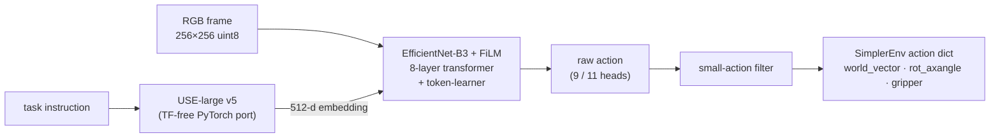

# RT-1 PyTorch

A **zero-TensorFlow PyTorch runtime** for the [RT-1](https://arxiv.org/abs/2212.06817) manipulation policy, drop-in compatible with [SimplerEnv](https://github.com/simpler-env/SimplerEnv). `rt1_pytorch.RT1Inference` replaces SimplerEnv's TensorFlow `RT1Inference` with the same API — no TF at runtime.

[](https://www.python.org/) [](https://pytorch.org/) [](https://img.shields.io/badge/tensorflow-free-brightgreen)



| Piece | Original TF runtime | This repo |
| --- | --- | --- |
| Policy network | TF SavedModel | TF → ONNX (`tf2onnx`) → PyTorch (`onnx2pytorch`) checkpoints in `models/` |
| Language embedding | TF Hub `universal-sentence-encoder-large/5` | TF-free PyTorch port, vendored as the [`universal_sentence_encoder`](universal_sentence_encoder/) git submodule (embeddings match TF Hub to ~2e-7) |
| Image preprocessing | `tf.image.resize_with_pad` | `resize_with_pad()` in `rt1_pytorch.py` — pixel-exact on SimplerEnv's 256×256 frames |
| Recurrent policy state | TF variables | ring buffer (`action_tokens`, `context_image_tokens`, `seq_idx`) carried across `step()` calls |

Everything else — the ~4800-node EfficientNet-B3 + FiLM + 8-layer transformer + token-learner and its 9 output heads — runs in PyTorch.

## Repository layout

| Path | What it is |
| --- | --- |
| `rt1_pytorch.py` | `RT1Inference` (PyTorch policy inference) + TF-exact `resize_with_pad` |
| `main.py` | SimplerEnv evaluation script (pick-the-coke-can episode) |
| `universal_sentence_encoder/` | git **submodule** → [paragduttaiisc/universal_sentence_encoder_pytorch](https://github.com/paragduttaiisc/universal_sentence_encoder_pytorch): TF Hub USE-large v5 ported to PyTorch (tokenizer + embedding model + 1.4 GB weights via Git LFS) |
| `models/` | RT-1 / RT-1-X PyTorch checkpoints, tracked with **Git LFS** |
| `requirements.txt` | pip requirements for the core runtime |

## Models

All checkpoints in `models/` are the **pre-Argmax logits variants**: besides the usual action heads they also expose `action_logits` / `token_logits` (see [step_logits](#step_logits--pre-argmax-teacher-logits-for-distillation)), so they can serve as teachers for knowledge distillation.

| File | Size | Description |
| --- | --- | --- |
| `models/rt1_logits_pt_model.pt` | 466 MB | **RT-1, converged** (default in `main.py`) |
| `models/rt1_15_logits_pt_model.pt` | 466 MB | RT-1 at 15 % of training (early checkpoint) |
| `models/rt1_begin_logits_pt_model.pt` | 466 MB | RT-1 at the beginning of training (early checkpoint) |
| `models/rt1x_logits_pt_model.pt` | 938 MB | **RT-1-X** (mobile base; adds `base_displacement_vector` / `base_displacement_vertical_rotation` heads → 11 outputs) |
| `models/rt1x_logits_pt_model_initial_state.npz` | 2.4 MB | sidecar with the RT-1-X checkpoint's exact TF `get_initial_state(batch_size=1)` ring buffers (loaded automatically when present next to the `.pt`) |

RT-1 checkpoints use the classic all-zero initial state; only the ring-buffer shapes differ (RT-1: `6×8` action tokens, RT-1-X: `15×11` / `15×81`).

## Getting started

### 1. Clone (with Git LFS + submodules)

The USE-large weights (`use_v5_embed.pt`, ~1.4 GB, in the submodule) and the RT-1 checkpoints (`models/*.pt`) are **Git LFS** objects, so a plain `git clone` leaves pointer files behind. Clone with:

```bash
git lfs install
git clone --recurse-submodules https://github.com/paragduttaiisc/RT1-Pytorch.git
cd RT1-Pytorch
```

Already have a clone?

```bash
git pull
git submodule update --init --recursive
git lfs pull
```

> **Note:** without [git-lfs](https://git-lfs.github.com/) installed, `use_v5_embed.pt` and `models/*.pt` check out as small text pointer files and loading fails.

### 2. Install

```bash
pip install -r requirements.txt
```

The submodule's own `universal_sentence_encoder/requirements.txt` (numpy / torch / onnx2pytorch) is a subset of this repo's `requirements.txt`.

### 3. Evaluate in SimplerEnv

[SimplerEnv](https://github.com/simpler-env/SimplerEnv) provides the ManiSkill2/SAPIEN real-to-sim environments. Its install is heavier and requires an **NVIDIA GPU** (SAPIEN) with **CUDA ≥ 11.8 and < 13**:

```bash
# python 3.10 or 3.11
conda create -n simpler_env python=3.10
conda activate simpler_env
pip install numpy==1.24.4            # numpy<2.0, required by SimplerEnv's IK

git clone https://github.com/simpler-env/SimplerEnv --recurse-submodules
cd SimplerEnv
pip install -e ManiSkill2_real2sim   # ManiSkill2 real-to-sim environments
pip install -e .                     # the simpler_env package
```

Then run the evaluation script from this repo:

```bash
cd RT1-Pytorch
python main.py
```

`main.py` drives one full simulated episode on SimplerEnv's
[`google_robot_pick_coke_can`](https://github.com/simpler-env/SimplerEnv#current-environments)
(`GraspSingleOpenedCokeCanInScene-v0`, visual-matching setup):

1. builds the ManiSkill2 env and reads the language instruction
   (`env.get_language_instruction()`, e.g. *"pick up the coke can"*);
2. loads `RT1Inference` with the selected checkpoint (the `model_path`
   constant near the bottom of `main.py` — the four commented lines switch
   between `rt1_logits_pt_model.pt`, `rt1x_logits_pt_model.pt`,
   `rt1_15_logits_pt_model.pt`, `rt1_begin_logits_pt_model.pt`);
3. every control step (3 Hz control / ~500 Hz sim, up to 80 steps per
   episode):
   - grabs the observation image with `get_image_from_maniskill2_obs_dict`,
   - calls `model.step(image, instruction)`,
   - applies the action with
     `env.step(np.concatenate([action["world_vector"], action["rot_axangle"], action["gripper"]]))`
     — 7-d: delta-xyz (3) + delta axis-angle rotation (3) + gripper closedness (1);
   - updates the instruction if the env advances to a new subtask.

Expected console output:

```
[rt1_pytorch] loading USE embedder from .../universal_sentence_encoder/use_v5_embed.pt ...
[rt1_pytorch] loading PyTorch policy from models/rt1_logits_pt_model.pt ...
RT-1 loaded successfully
Instruction: pick up the coke can
...
Episode stats: {...}
```

Notes:

- `render_mode="human"` opens a Matplotlib window per step; for headless
  machines pass `render_mode="rgb_array"` (or drop the argument).
- `info["episode_stats"]` (printed at the end) carries the episode
  success/length metrics reported by SimplerEnv.
- **RT-1-X**: the processed `action` dict always contains the same 4 keys
  (`world_vector`, `rot_axangle`, `gripper`, `terminate_episode`); the extra
  mobile-base heads of RT-1-X appear in `raw_action`
  (`base_displacement_vector`, `base_displacement_vertical_rotation`) and are
  unused by the static google-robot env.

## Policy API

```python
from rt1_pytorch import RT1Inference

pol = RT1Inference(
    pt_model_path="models/rt1_logits_pt_model.pt",
    image_width=320,          # policy input size
    image_height=256,
    action_scale=1.0,
    policy_setup="google_robot",
)
pol.reset("pick up the coke can")
raw_action, action = pol.step(image_uint8_hwc)
```

- `reset(task_description)` — embeds the task with the USE embedder and
  (re)initializes the ring-buffer policy state.
- `step(image, task_description=None) → (raw_action, action)` — one control
  step; a *changed* task description resets the policy state automatically.
  `image` is a uint8 `(H, W, 3)` array (any size; internally resized with
  TF-exact `resize_with_pad` to 256×320).
  - `action` (what SimplerEnv's TF class returns):
    `world_vector` `(3,)`, `rot_axangle` `(3,)`, `gripper` `(1,)`,
    `terminate_episode`.
  - `raw_action`: unfiltered policy heads, SimplerEnv key names
    (`world_vector`, `rotation_delta`, `gripper_closedness_action`,
    `terminate_episode`, + base heads for RT-1-X), after the small-action
    filter (values below 5e-3 arm / 1e-2 gripper zeroed).

### `step_logits` — pre-Argmax teacher logits (for distillation)

```python
raw_action, action, action_logits, token_logits = pol.step_logits(image, "pick up the coke can")
```

`step_logits` runs the **identical** forward pass and state update as
`step()`, and additionally returns the final dense-head logits that the
checkpoint `ArgMax`es into action bin ids — the pre-quantization outputs of
the teacher:

| Model | `action_logits` | `token_logits` |
| --- | --- | --- |
| RT-1 family | `(8, 255)` — one row per action token: rows 0–2 world xyz, 3–5 rotation axis-angle, 6 gripper, 7 spare | `(96, 255)` — head output over all 96 transformer tokens (6 slots × (8 image + 8 action) placeholders) |
| RT-1-X | `(11, 512)` | `(1380, 512)` |

Verified invariant: `np.argmax(action_logits, axis=-1)` reproduces the bin ids
the model writes into `state/action_tokens` (the most recent context slot),
i.e. the logits are exactly the distribution over the action bins that
`step()`'s action is derived from.

`step_logits` raises `RuntimeError` if the loaded `.pt` lacks the
`action_logits` / `token_logits` outputs — all checkpoints shipped in
`models/` have them.

### Knowledge distillation

Use `step_logits` as the teacher signal instead of (or in addition to) the
hard actions: a student network can be trained to match the teacher's soft
bin distributions, e.g. per-row cross-entropy / KL over
`action_logits` (and optionally `token_logits` for token-level distillation),
while the student's own decoded actions drive the environment. Because
`step_logits` advances the policy state exactly like `step()`, teacher and
student stay on the same policy trajectory (ring-buffer state, task resets)
and the soft targets are on-distribution.

```python
import torch

raw, act, act_logits, tok_logits = pol.step_logits(img, instruction)
teacher = torch.from_numpy(act_logits)        # [8, 255] float32, batched as needed
# loss += F.kl_div(student_logits.log_softmax(-1), teacher.softmax(-1), reduction="batchmean")
```

## References

- **RT-1: Robotics Transformer for Real-World Control at Scale** —
  [arXiv:2212.06817](https://arxiv.org/abs/2212.06817)
- **SimplerEnv** — real-to-sim evaluation environments:
  [github.com/simpler-env/SimplerEnv](https://github.com/simpler-env/SimplerEnv)
- **RT-1-X / Open X-Embodiment** — [arXiv:2310.08864](https://arxiv.org/abs/2310.08864)
- **Universal Sentence Encoder (TF Hub)** —
  [tfhub.dev/google/universal-sentence-encoder-large/5](https://tfhub.dev/google/universal-sentence-encoder-large/5),
  ported in the [`universal_sentence_encoder`](universal_sentence_encoder/) submodule

## License

[Apache-2.0](LICENSE)
